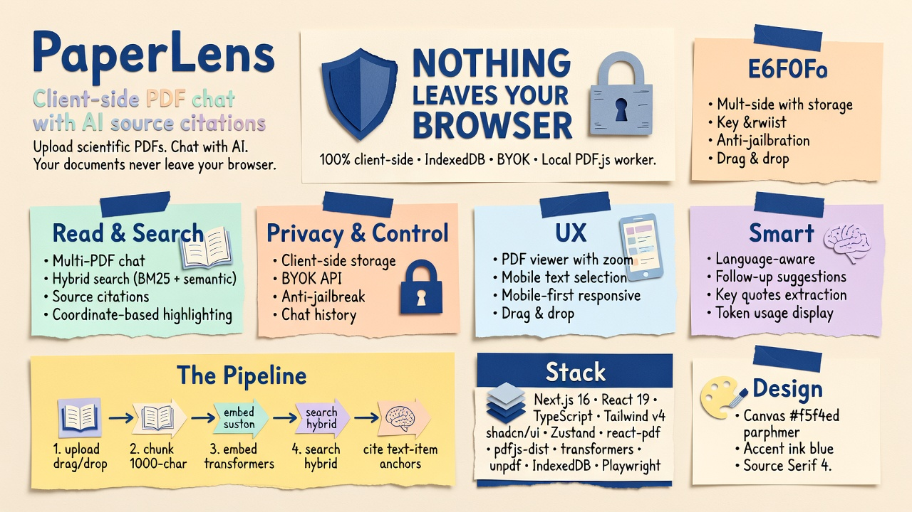
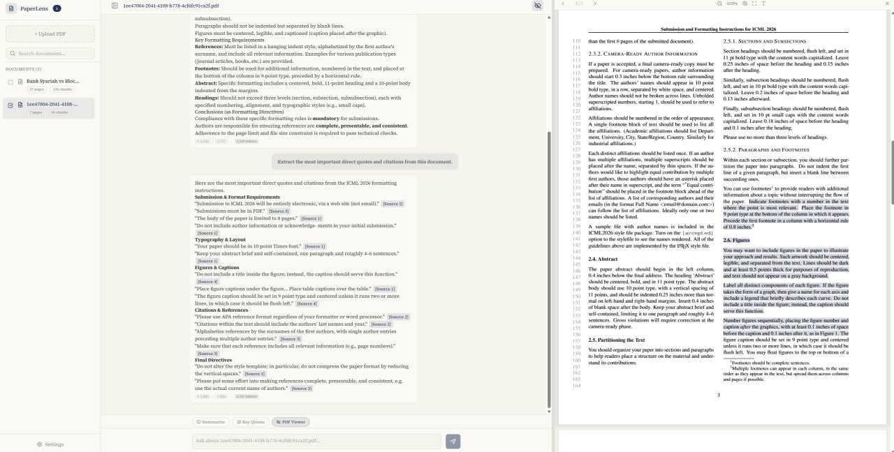

# PaperLens

> Upload scientific PDFs — thesis, journals, reports — and chat with AI about their content. Your documents stay in your browser, nothing leaves your device.


## Demo

<video src="https://github.com/farizvect/paperlens/raw/main/public/paperlens-promo.mp4" controls width="100%"></video>




## Features

- **Multi-PDF chat** — select multiple documents and ask questions across all of them
- **Hybrid search** — BM25 keyword search combined with semantic embeddings (`@huggingface/transformers`) for better retrieval
- **Source citations** — every answer includes clickable `[Source N]` references with chunk excerpts
- **Coordinate-based highlighting** — PDF text items extracted at upload time with position data; source clicks jump to exact location using text-item anchors (not fuzzy search)
- **Client-side storage** — all data lives in IndexedDB (documents, chunks, chat history)
- **PDF viewer** — built-in viewer with zoom, page navigation, virtualized rendering (currentPage ± 2), and source highlighting
- **Mobile text selection** — text layer disabled on mobile by default (saves memory), toggle via toolbar
- **Mobile-first** — responsive sidebar, hamburger toggle, body scroll lock, CSS grid layout, horizontal-swipe code blocks
- **BYOK API** — bring your own OpenAI-compatible API key and base URL via Settings
- **Language-aware** — AI detects the PDF language and responds in the same language
- **Anti-jailbreak** — system prompt scoped to document analysis only; blocks roleplay, instruction injection, and prompt exfiltration
- **Drag & drop** — drop PDFs anywhere on the chat area
- **Follow-up suggestions** — AI generates follow-up questions after each response
- **Key quotes extraction** — one-click extraction of important quotes with citations
- **Chat history persistence** — conversations saved per document, restored on revisit
- **Token usage display** — shows input/output token counts per response
- **Onboarding tutorial** — guided first-use experience

## Stack

- **Next.js 16** (App Router, Turbopack)
- **React 19** + **TypeScript**
- **Tailwind CSS v4** + **shadcn/ui**
- **Zustand** for state management
- **react-pdf** + **pdfjs-dist** for PDF rendering (local worker, no CDN dependency)
- **@huggingface/transformers** for client-side semantic embeddings
- **unpdf** for client-side PDF parsing
- **react-markdown** + **remark-gfm** for Markdown rendering
- **IndexedDB** for all client-side storage
- **Playwright** for end-to-end testing

## Getting Started

### Prerequisites

- **Node.js** 18+ (recommended: 20+)
- **npm** or **yarn** or **bun**
- **OpenAI-compatible API key** (OpenAI, Anthropic, Groq, Together, etc.)

### Installation

```bash
# Clone the repo
git clone https://github.com/farizvect/paperlens.git
cd paperlens

# Install dependencies
npm install

# Start dev server
npm run dev
```

Dev server runs on `http://localhost:3005` by default.

### First Launch

1. Open `http://localhost:3005` in your browser
2. Click **Settings** in the sidebar
3. Enter your API credentials:
   - **Base URL** — e.g., `https://api.openai.com/v1`
   - **API Key** — your API key
   - **Model** — e.g., `gpt-4o-mini`
4. Upload a PDF via drag-drop or file picker
5. Start chatting with your document

### Production Build

```bash
npm run build
npm run start
```

### Environment Variables (Optional)

Copy the example env file and configure your API defaults:

```bash
cp .env.example .env
```

Edit `.env` with your credentials:

```env
# LLM API Configuration (OpenAI-compatible)
# Users can also override these via the Settings dialog in the UI.
LLM_BASE_URL=https://api.openai.com/v1
LLM_MODEL=gpt-4o-mini
LLM_API_KEY=sk-your-api-key-here
```

These are server-side defaults. Users can override them via the Settings dialog in the UI.

## Testing

```bash
# Run Playwright tests
npx playwright test

# Run with UI
npx playwright test --ui
```

Tests cover layout integrity, PDF upload, viewer functionality, and virtualization behavior.

## Project Structure

```
src/
├── app/
│   ├── api/chat/route.ts    # Streaming SSE chat endpoint
│   ├── globals.css           # Theme (parchment + ink blue), animations
│   ├── layout.tsx            # Root layout with Source Serif 4 font
│   └── page.tsx              # Main page
├── components/
│   ├── chat-panel.tsx        # Chat UI orchestrator
│   ├── chat-empty-state.tsx  # Empty state with upload prompt
│   ├── chat-input.tsx        # Message input with drag-drop
│   ├── chat-messages.tsx     # Message list with auto-scroll
│   ├── pdf-viewer.tsx        # Dynamic import wrapper (SSR-safe)
│   ├── pdf-viewer-inner.tsx  # PDF viewer with virtualization
│   ├── resizable-split.tsx   # Resizable panel split (8px gutter)
│   ├── sidebar.tsx           # Document list, search, upload, multi-select
│   ├── message-bubble.tsx    # Markdown rendering with source badges
│   ├── source-card.tsx       # Citation excerpt display
│   ├── settings-dialog.tsx   # BYOK API configuration
│   ├── onboarding.tsx        # First-use tutorial
│   ├── store-hydrator.tsx    # SSR-safe Zustand hydration
│   ├── loading-skeleton.tsx  # Shimmer loading states
│   └── ui/                   # shadcn/ui primitives
├── hooks/
│   └── use-chat-streaming.ts # Chat streaming + source handling
├── lib/
│   ├── client/
│   │   ├── pdf.ts            # unpdf text extraction + pdf.js text items
│   │   └── storage.ts        # IndexedDB (documents, chunks, chats)
│   ├── rag/
│   │   ├── chunker.ts        # Sentence-boundary chunking (1000 char, 200 overlap)
│   │   ├── embeddings.ts     # @huggingface/transformers embeddings
│   │   └── highlight-anchors.ts  # Text-item position extraction for PDF highlighting
│   ├── search/
│   │   └── hybrid.ts         # BM25 + semantic hybrid search
│   ├── rate-limit.ts         # Server-side rate limiting
│   └── utils.ts              # cn() utility
├── store/
│   └── chat.ts               # Zustand store (messages, activeDoc, llmSettings)
tests/
├── layout.spec.ts            # Layout integrity tests
├── upload.spec.ts            # PDF upload tests
├── pdf-viewer.spec.ts        # PDF viewer and virtualization tests
└── highlight-anchors.spec.ts # Highlight anchor extraction tests
```

## Configuration

### API Settings (BYOK)

Click **Settings** in the sidebar to configure:

- **Base URL** — any OpenAI-compatible endpoint (e.g., `https://api.openai.com/v1`)
- **API Key** — your API key
- **Model** — model name (e.g., `gpt-4o-mini`, `gpt-4`, `claude-3-sonnet`)

Settings are persisted in `localStorage`.

### Design System

- **Canvas**: `#f5f4ed` parchment (never pure white)
- **Accent**: Ink blue `#1B365D` only
- **Neutrals**: Warm-toned (yellow-brown undertone)
- **Typography**: Source Serif 4, weight 400 body / 500 headings
- **Animations**: Message slide-in, sidebar toggle, drag overlay, shimmer skeletons

## How It Works

1. **Upload** — PDF is parsed client-side with `unpdf`; pdf.js text items extracted with position data for coordinate-based highlighting
2. **Chunk** — Text chunked into ~1000-char segments with section awareness; each chunk stores `highlightRange` (page, start, end text-item indices)
3. **Embed** — Chunks embedded with `@huggingface/transformers` for semantic search
4. **Store** — Chunks + embeddings saved to IndexedDB with full-text search index
5. **Query** — User question runs hybrid search (BM25 + semantic), top 8 results selected
6. **Stream** — Context + question sent to LLM via `/api/chat` (SSE streaming)
7. **Display** — Response rendered as Markdown with `[Source N]` citation badges
8. **Highlight** — Click `[Source N]` to open PDF viewer; highlights drawn using stored text-item coordinates (falls back to fuzzy search for legacy docs)

## Security

- **Anti-jailbreak system prompt** — scoped to document analysis; blocks roleplay, instruction injection, and prompt exfiltration
- **PDF context as reference only** — instructions embedded in uploaded documents are not executed
- **Rate limiting** — server-side IP-based rate limiting on chat endpoint
- **SSRF protection** — base URL validation blocks private/internal IPs

## Privacy

All processing happens in your browser:
- PDFs are parsed client-side using `unpdf`
- Embeddings generated client-side with `@huggingface/transformers` (ONNX runtime)
- Documents and chat history stored in IndexedDB
- Only the query + relevant chunks sent to your configured API
- No data leaves your device except what you explicitly send to the LLM

## License

MIT
