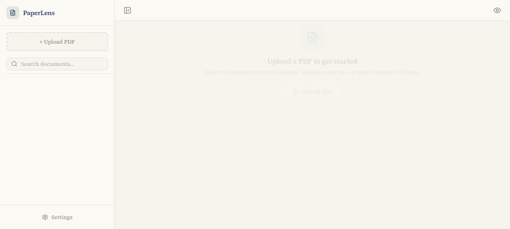
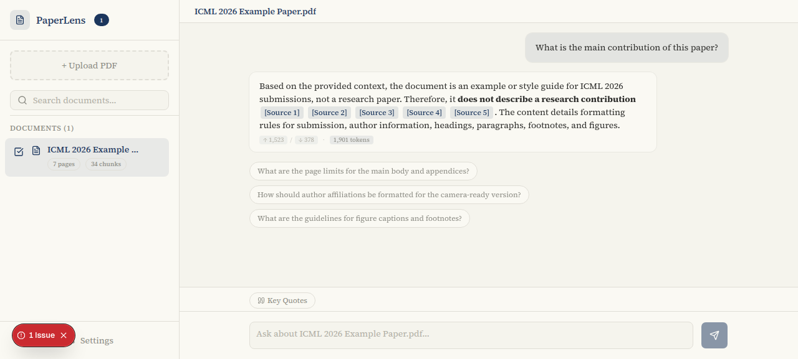
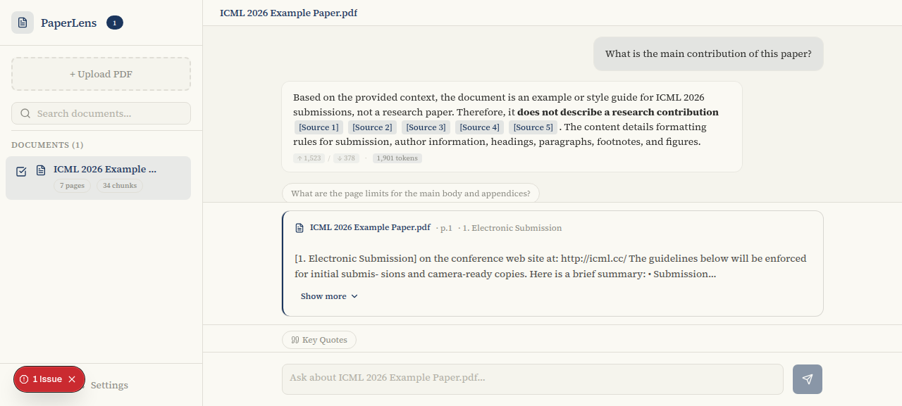
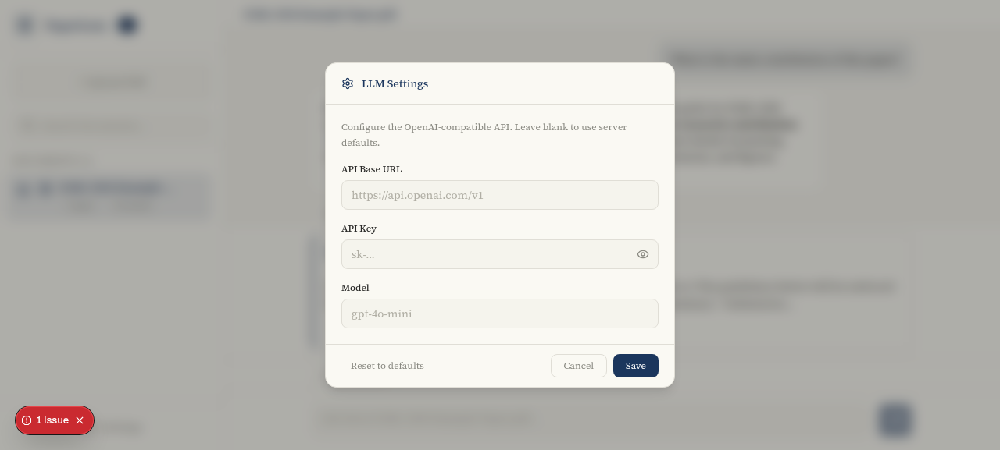

# PaperLens

> Upload scientific PDFs — thesis, journals, reports — and chat with AI about their content. Your documents stay in your browser, nothing leaves your device.



## Features

- **Multi-PDF chat** — select multiple documents and ask questions across all of them
- **RAG pipeline** — keyword-based search (FTS5) with section-aware chunking, no embeddings required
- **Source citations** — every answer includes clickable `[Source N]` references with chunk excerpts
- **Client-side storage** — all data lives in IndexedDB (documents, chunks, chat history)
- **BYOK API** — bring your own OpenAI-compatible API key and base URL via Settings
- **Language-aware** — AI detects the PDF language and responds in the same language
- **Mobile-first** — responsive sidebar, hamburger toggle, body scroll lock
- **Drag & drop** — drop PDFs anywhere on the chat area
- **Follow-up suggestions** — AI generates follow-up questions after each response
- **Key quotes extraction** — one-click extraction of important quotes with citations
- **Chat history persistence** — conversations saved per document, restored on revisit
- **Token usage display** — shows input/output token counts per response
- **Onboarding tutorial** — guided first-use experience

## Screenshots

### Upload & Document Management


Upload PDFs via drag-drop or file picker. Documents are processed client-side with `unpdf` and chunked into searchable segments.

### Chat with AI



Ask questions about your documents and get AI-powered answers with source citations. Click `[Source N]` badges to see the exact excerpt from the PDF.

### Source Citations



Each source citation shows the page number, section name, and relevant text excerpt. Transparency in every answer.

### BYOK Settings



Configure your own OpenAI-compatible API endpoint, key, and model. Works with any provider that supports the OpenAI API format.

## Stack

- **Next.js 16** (App Router, Turbopack)
- **React 19** + **TypeScript**
- **Tailwind CSS v4** + **shadcn/ui**
- **Zustand** for state management
- **unpdf** for client-side PDF parsing
- **react-markdown** + **remark-gfm** for Markdown rendering
- **IndexedDB** for all client-side storage

## Getting Started

```bash
# Install dependencies
npm install

# Run dev server
npm run dev

# Build for production
npm run build
npm run start
```

Dev server runs on `http://localhost:3005` by default.

## Project Structure

```
src/
├── app/
│   ├── api/chat/route.ts    # Streaming SSE chat endpoint
│   ├── globals.css           # Theme (parchment + ink blue), animations
│   ├── layout.tsx            # Root layout with Source Serif 4 font
│   └── page.tsx              # Main page
├── components/
│   ├── chat-panel.tsx        # Chat UI, upload, drag-drop, message flow
│   ├── sidebar.tsx           # Document list, search, upload, multi-select
│   ├── message-bubble.tsx    # Markdown rendering with source badges
│   ├── source-card.tsx       # Citation excerpt display
│   ├── settings-dialog.tsx   # BYOK API configuration
│   ├── onboarding.tsx        # First-use tutorial
│   ├── store-hydrator.tsx    # SSR-safe Zustand hydration
│   ├── loading-skeleton.tsx  # Shimmer loading states
│   └── ui/                   # shadcn/ui primitives
├── lib/
│   ├── client/
│   │   ├── pdf.ts            # unpdf text extraction
│   │   └── storage.ts        # IndexedDB (documents, chunks, chats)
│   ├── rag/
│   │   └── chunker.ts        # Sentence-boundary chunking (1000 char, 200 overlap)
│   ├── rate-limit.ts         # Server-side rate limiting
│   └── utils.ts              # cn() utility
├── store/
│   └── chat.ts               # Zustand store (messages, activeDoc, llmSettings)
```

## Configuration

### API Settings (BYOK)

Click **Settings** in the sidebar to configure:

- **Base URL** — any OpenAI-compatible endpoint (e.g., `https://api.openai.com/v1`)
- **API Key** — your API key
- **Model** — model name (e.g., `gpt-4o-mini`, `gpt-4`, `claude-3-sonnet`)

Settings are persisted in `localStorage`.

### Design System

- **Canvas**: `#f5f4ed` parchment (never pure white)
- **Accent**: Ink blue `#1B365D` only
- **Neutrals**: Warm-toned (yellow-brown undertone)
- **Typography**: Source Serif 4, weight 400 body / 500 headings
- **Animations**: Message slide-in, sidebar toggle, drag overlay, shimmer skeletons

## How It Works

1. **Upload** — PDF is parsed client-side with `unpdf`, chunked into ~1000-char segments with section awareness
2. **Store** — Chunks saved to IndexedDB with full-text search index
3. **Query** — User question searches chunks by keywords, top 8 results selected
4. **Stream** — Context + question sent to LLM via `/api/chat` (SSE streaming)
5. **Display** — Response rendered as Markdown with `[Source N]` citation badges

## Privacy

All processing happens in your browser:
- PDFs are parsed client-side using `unpdf`
- Documents and chat history stored in IndexedDB
- Only the query + relevant chunks sent to your configured API
- No data leaves your device except what you explicitly send to the LLM

## License

MIT
